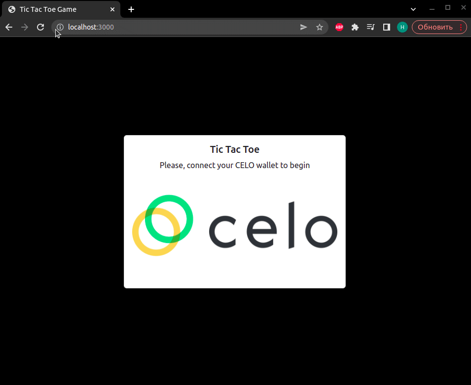
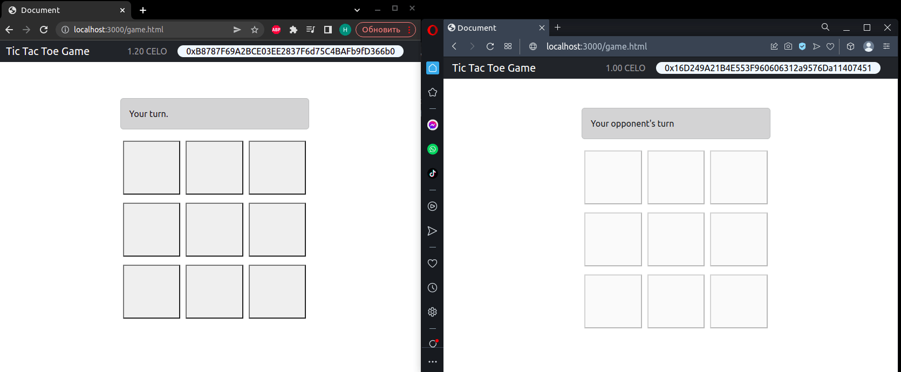
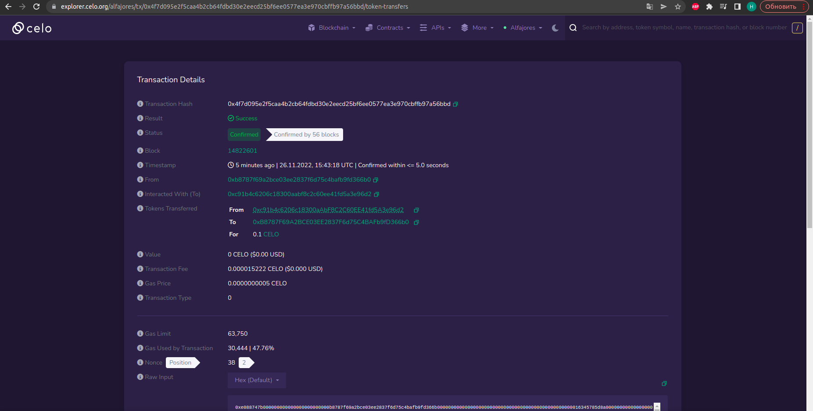
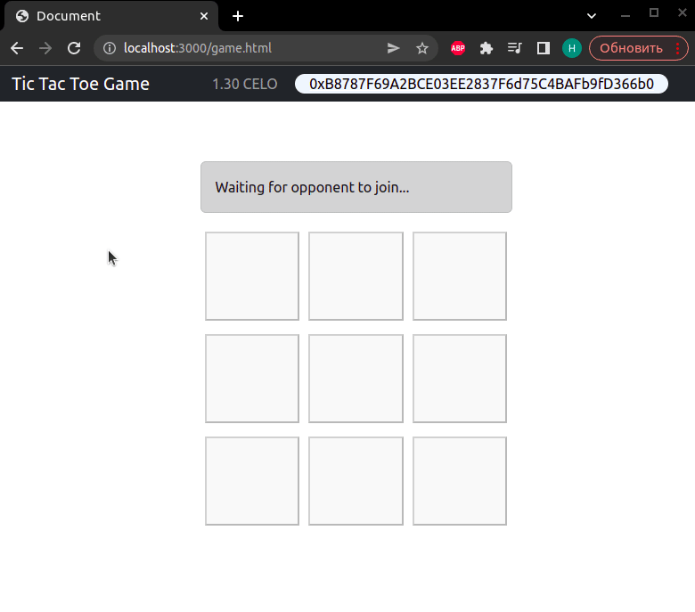
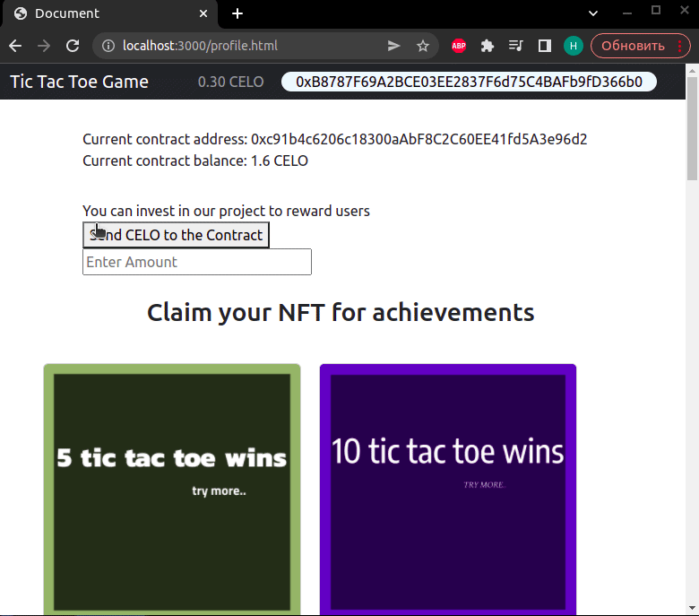
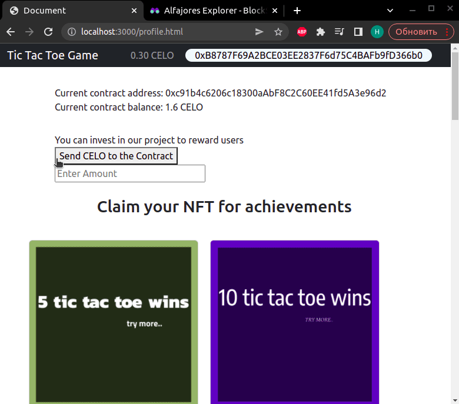

# Tic Tac Toe

## Description

Disclaimer: this is a practic project for the dacade.org course.
Disclaimer 2: if you have any question or other things to say, you can always write me on telegram - @yaroslaviks

This is a web application for Tic Tac Toe online, that gives an ability for players to battle against each other. For every win, a player gets rewarded with 0.1 CELO. Also, players can deposit their funds to the contract to help the organization.

Every player's win is written as a transaction and can be viewed in CELO explorer. 

Also there are achievements players can complete(win 5 times, win 10 times). For every achievement, player can mint achievement NFT.

##NOTE
WALLET REQUIRED TO TEST THIS DAPP IS [CELO EXTENSION WALLET](https://chrome.google.com/webstore/detail/celoextensionwallet/kkilomkmpmkbdnfelcpgckmpcaemjcdh?hl=en)


## Live Demo

https://sage-toffee-de617f.netlify.app

In addition, production server source - https://glitch.com/~smart-scrawny-cirrus

## Site review

```
To authorize we need to connect a CELO wallet
after successful authorization we see a TicTacToe board, user's wallet address and balance
```



```
When two players are on the site, the game will begin
Players see each other's step in real time, because of Websocket used in the project.
After a win, a player gets rewarded with 0.1 CELO, he just needs to pay fee and wait a couple seconds
```



```
We can watch reward(win) transaction on CELO explorer
```
* [link to the transaction](https://explorer.celo.org/alfajores/tx/0x4f7d095e2f5caa4b2cb64fdbd30e2eecd25bf6ee0577ea3e970cbffb97a56bbd/token-transfers)



## Profile Page
```
Player sees a contract's address and balance, also player can deposit CELO funds to the contract to help the project reward users
```


```
Players have an achievements for 5 wins and 10 wins.
After every achievement, a player can mint an NFT.
```


```
Also, the winnings history can be viewed on the profile page.
User's sign(X or O) are green on the board.
All of these information are saved in blockchain and we can see every transaction.
```


## Contracts Addresses

Transactions contract address - 0xc91b4c6206c18300aAbF8C2C60EE41fd5A3e96d2

NFT contract address - 0x6CDb04E6837B2b322E2D15D86d3793F84f47f41F
## Installation / Setup instruction
* Open Terminal {Ctrl+Alt+T}

* ```git clone ```

* ```cd tictactoecelo```

* ```code .``` or ```atom .``` depending on the text editor of your choise.


## Technologies Used

* [HTML5](https://developer.mozilla.org/en-US/docs/Web/Guide/HTML/HTML5)
* [CSS](https://kristofferandreasen.github.io/wickedCSS/)
* markdown
* [Bootstrap](https://getbootstrap.com/docs/4.5/getting-started/introduction/)
* [jQuery](https://api.jquery.com/)
* [JavaScript](https://devdocs.io/javascript/)
* [ExpressJS](https://expressjs.com/)
* [Webpack](https://webpack.js.org/)
* [WebsocketJS](https://developer.mozilla.org/en-US/docs/Web/API/WebSocket)


## License
> *MIT License:*
> {Determine the license under which this application can be used.  See below for more details on licensing.}*[LICENSE](LICENSE)
> Copyright &copy; 2022 

# Install
Installing server packages and running it
```

cd server

```

```

npm ci

```
```

node server.js

```

In another terminal installing frontend packages and running it:
```

cd client

```

```

npm ci

```
```

node index.js

```

In addition we need to recompile contracts and enter NFT contract owner's private key to .env file (/client/.env) to sign transactions

# Build

```

npm run build

```
# Usage
1. Install the [CeloExtensionWallet](https://chrome.google.com/webstore/detail/celoextensionwallet/kkilomkmpmkbdnfelcpgckmpcaemjcdh?hl=en) from the google chrome store.
2. Create a wallet.
3. Go to [https://celo.org/developers/faucet](https://celo.org/developers/faucet) and get tokens for the alfajores testnet.
4. Switch to the alfajores testnet in the CeloExtensionWallet.